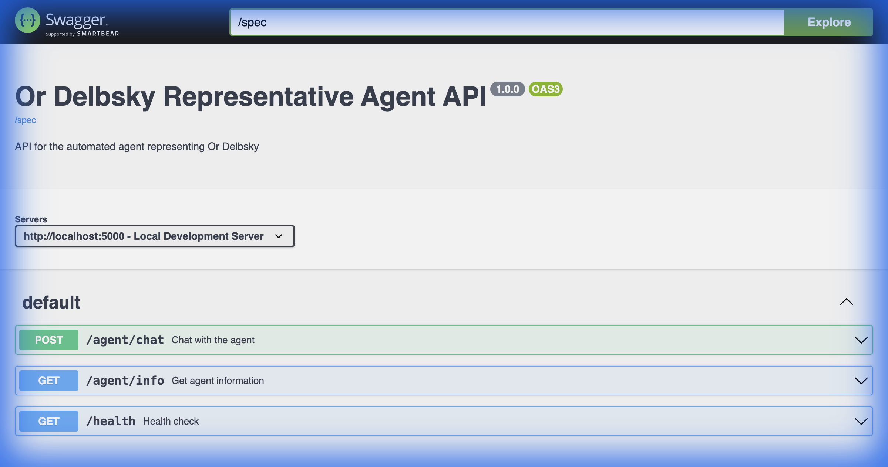
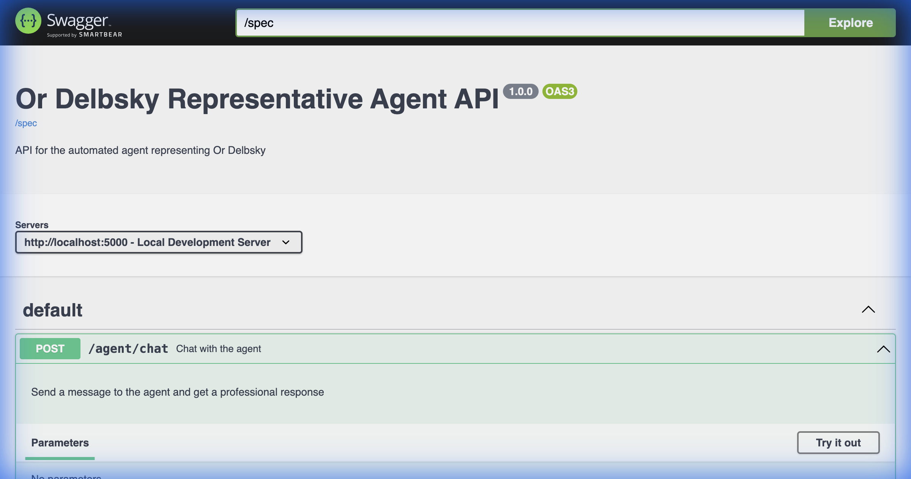

# Or Delbsky Representative Agent 🤖

An intelligent, professional AI agent designed to represent Or Delbsky to recruiters and employers. Built with Google Gemini and Flask.



## 📋 Overview

This agent acts as a professional representative for Or Delbsky, autonomously answering inquiries from recruiters and HR professionals. It maintains a polite, formal, and credible tone while providing accurate information based on Or's CV and comprehensive professional profile.

The agent is powered by Google's Gemini 2.0 Flash model, ensuring high-quality, context-aware responses in Hebrew.

## 🌟 Key Features

-   **Automated Professional Responses**: Handles inquiries with a consistent, respectful, and professional persona.
-   **Context-Aware**: deeply integrated with Or's CV and Professional Profile PDF documents to provide accurate specific details.
-   **REST API**: Fully functional Flask-based REST API for easy integration.
-   **Swagger UI Documentation**: Interactive API documentation for easy testing and exploration.
-   **Hebrew Language Support**: Native-level Hebrew interaction capabilities.

## 🛠️ Tech Stack

-   **Python 3.9+**
-   **Flask**: Lightweight web server.
-   **Google Gemini API (genai)**: Advanced LLM for reasoning and text generation.
-   **Flasgger / Swagger UI**: API visualization and testing.

## 🚀 Getting Started

### Prerequisites

-   Python 3.9 or higher.
-   A Google Cloud Project with the Gemini API enabled.
-   An API Key from [Google AI Studio](https://aistudio.google.com/app/apikey).

### Installation

1.  **Clone the repository:**
    ```bash
    git clone https://github.com/delevski/ADK-AGENT-TEST.git
    cd ADK-AGENT-TEST
    ```

2.  **Install dependencies:**
    ```bash
    pip install -r requirements.txt
    ```

3.  **Configure Environment:**
    Create a `.env` file in the root directory and add your Google API key:
    ```bash
    GOOGLE_API_KEY=your_api_key_here_xxxxx
    ```
    *(You can use `.env.example` as a template)*

### Running the Server

Start the application:

```bash
python agent_server.py
```

The server will start on `http://localhost:5000`.

## 📖 Usage & API Documentation

Once the server is running, you can access the interactive API documentation (Swagger UI) at:

**[http://localhost:5000/docs](http://localhost:5000/docs)**



### Endpoints

#### `POST /agent/chat`
Send a message to the agent.

**Request Body:**
```json
{
  "message": "Tell me about Or's experience throughout the years",
  "context": "We are looking for a Senior Full Stack Developer"
}
```

**Response:**
```json
{
  "response": "Or has over 5 years of experience...",
  "status": "success"
}
```

#### `GET /agent/info`
Retrieve information about the running agent configuration.

#### `GET /health`
Health check endpoint to verify server status.

## ⚙️ Configuration

The agent is configured via `agent_config.yaml`. You can customize:

-   **System Instructions**: Modify the persona and guidelines.
-   **Model**: Change the Gemini model version (e.g., `gemini-1.5-flash`).
-   **Resources**: Add or remove reference documents (PDFs).

## ⚠️ Troubleshooting

**Rate Limits (`429 RESOURCE_EXHAUSTED`)**
If you are using a free tier API key, you might encounter rate limits.
-   **Solution**: Wait a minute for the quota to reset, or upgrade to a paid plan.

**Model Not Found (`404 NOT_FOUND`)**
-   **Solution**: Ensure the model specified in `agent_config.yaml` is available for your API key/region.

## 📝 License

Private project representing Or Delbsky.
